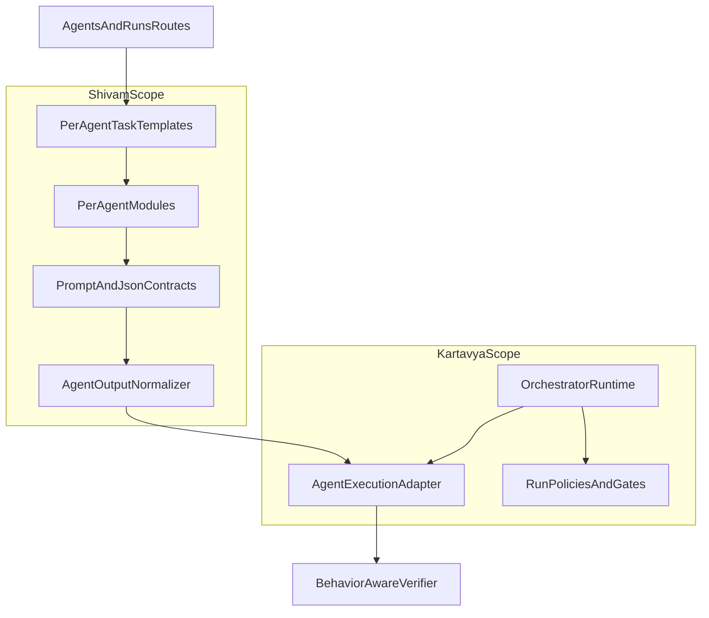

# Deep Agent Specialization Plan [SHIVAM, Aligned]

## Goal

Transform the current non-orchestrator agent runtime into a modular, reusable, and strict system where each in-scope agent has:

- its own file,
- a deeply specialized behavior contract,
- strict JSON-only output schema guidance,
- deterministic and low/medium token response constraints,
- task templates aligned to its function (not orchestration flow),
- adapter-friendly normalized outputs that orchestrator runtime can consume safely.

This plan is intentionally compatible with `orchestrator_pipeline_runtime_master_plan_6103e03d.plan.md` and avoids taking ownership of orchestrator policy/persistence logic.

Primary implementation references:

- [C:/Users/skhar/Downloads/2026-RevolutionUC-Hackathon-Datalyze/apps/api/src/services/agent_registry.py](C:/Users/skhar/Downloads/2026-RevolutionUC-Hackathon-Datalyze/apps/api/src/services/agent_registry.py)
- [C:/Users/skhar/Downloads/2026-RevolutionUC-Hackathon-Datalyze/apps/api/src/services/crew_mvp.py](C:/Users/skhar/Downloads/2026-RevolutionUC-Hackathon-Datalyze/apps/api/src/services/crew_mvp.py)
- [C:/Users/skhar/Downloads/2026-RevolutionUC-Hackathon-Datalyze/apps/api/src/api/v1/routes/agents.py](C:/Users/skhar/Downloads/2026-RevolutionUC-Hackathon-Datalyze/apps/api/src/api/v1/routes/agents.py)
- [C:/Users/skhar/Downloads/2026-RevolutionUC-Hackathon-Datalyze/apps/api/scripts/verify_all_agents.py](C:/Users/skhar/Downloads/2026-RevolutionUC-Hackathon-Datalyze/apps/api/scripts/verify_all_agents.py)
- [C:/Users/skhar/Downloads/2026-RevolutionUC-Hackathon-Datalyze/.cursor/plans/orchestrator_pipeline_runtime_master_plan_6103e03d.plan.md](C:/Users/skhar/Downloads/2026-RevolutionUC-Hackathon-Datalyze/.cursor/plans/orchestrator_pipeline_runtime_master_plan_6103e03d.plan.md)

## Scope Lock

- In-scope: all current non-orchestrator agents except `data_provenance_tracker`.
- Out-of-scope: orchestrator runtime engine, orchestration policy, run persistence topology, run replay, stage gates (owned by Kartavya plan).
- Shared seam: stable execution contract between orchestrator adapter and specialized agents.

## Phase 0 — Cross-Branch Alignment Guardrails

- Define and freeze integration seam that both branches will honor:
  - Specialized agents emit JSON constrained to per-agent schema.
  - A normalization layer maps per-agent output into adapter envelope expected by orchestrator branch:
    - `status`, `summary`, `artifacts`, `next_hints`, `confidence`, `errors`.
- Write a branch-safe touch map:
  - Shivam edits: `services/agents/*`, `services/agent_registry.py`, `services/crew_mvp.py` replacement path, `routes/agents.py`, verify scripts.
  - Kartavya edits: `services/orchestrator_runtime/*`, `routes/runs.py`, persistence/migrations, replay/live APIs.
- Set merge policy:
  - no direct edits to each other’s internal modules,
  - only additive adapter/normalizer bridge where needed.

## Phase 1 — Agent Contract Pack (Design Before Build)

- Create an explicit contract pack from current registry metadata for each in-scope agent:
  - role intent,
  - input shape assumptions,
  - output JSON schema (required keys + optional keys),
  - strictness mode (`strict` vs `guarded`),
  - concise response budget guidance.
- Keep track logic minimal inside agents (functional specialization only), because orchestrator decides sequencing and track adaptation.
- Define uniform JSON constraints:
  - object root only,
  - no prose outside JSON,
  - deterministic field naming and type-stable values.
- Add per-agent “out-of-scope guard” language (without over-verbose allow/deny tables) to reduce drift.

## Phase 2 — Per-Agent Module Generation (One File per Agent)

- Implement one Python constructor module per in-scope non-orchestrator agent (excluding `data_provenance_tracker`).
- Each module should encapsulate:
  - agent identity constants,
  - deep system prompt,
  - expected JSON schema for that agent,
  - token/verbosity constraints,
  - per-agent task template factory for CrewAI tasks.
- Keep model binding out of these files and in `agent_registry.py` only.
- Add shared prompt utilities for JSON policy, deterministic style, concise outputs, and reusable format helpers.
- Add one central loader/index for importing builders into registry and runtime.

## Phase 3 — Registry and Runtime Wiring (Full MVP Replacement)

- Refactor [C:/Users/skhar/Downloads/2026-RevolutionUC-Hackathon-Datalyze/apps/api/src/services/agent_registry.py](C:/Users/skhar/Downloads/2026-RevolutionUC-Hackathon-Datalyze/apps/api/src/services/agent_registry.py) to consume per-agent constructors.
- Preserve current model type designation and dependency metadata as source-of-truth.
- Replace [C:/Users/skhar/Downloads/2026-RevolutionUC-Hackathon-Datalyze/apps/api/src/services/crew_mvp.py](C:/Users/skhar/Downloads/2026-RevolutionUC-Hackathon-Datalyze/apps/api/src/services/crew_mvp.py) with modular runtime entrypoints (non-orchestrator concerns only).
- Update [C:/Users/skhar/Downloads/2026-RevolutionUC-Hackathon-Datalyze/apps/api/src/api/v1/routes/agents.py](C:/Users/skhar/Downloads/2026-RevolutionUC-Hackathon-Datalyze/apps/api/src/api/v1/routes/agents.py) imports and call sites to new runtime modules.
- Keep route-level compatibility where possible so teammate branch can integrate adapter calls without route churn.

## Phase 4 — Verification Upgrade (Behavior, Not Just Liveness)

- Upgrade verification from generic ping to role-intent checks.
- Extend [C:/Users/skhar/Downloads/2026-RevolutionUC-Hackathon-Datalyze/apps/api/scripts/verify_all_agents.py](C:/Users/skhar/Downloads/2026-RevolutionUC-Hackathon-Datalyze/apps/api/scripts/verify_all_agents.py) and API verification path to validate:
  - valid JSON output,
  - schema key compliance per agent,
  - concise output budget,
  - high-level scope compliance (agent stays in role).
- Add deterministic test prompts per agent category and store expected minimal schema checks.
- Add compatibility check that per-agent outputs can be normalized into orchestrator adapter envelope fields.

## Phase 5 — Merge-Ready Handoff Pack

- Create integration notes for Kartavya branch:
  - final per-agent module paths,
  - schema map by agent id,
  - normalizer function signatures and guarantees.
- Provide merge checklist:
  - no orchestrator internals touched,
  - adapter seam stable,
  - route and registry import conflicts minimized.
- Document post-merge sequencing:
  1. merge specialization branch,
  2. bind adapter calls in orchestrator runtime,
  3. run combined verification matrix.
- Ensure MVP naming is removed from implementation internals, while preserving compatibility aliases only where needed during transition.

## Proposed Runtime Shape (Post-Refactor)

## Success Criteria

- Every in-scope non-orchestrator agent is in its own file with deep, role-specific prompt logic.
- All agent outputs are JSON-structured and schema-guided by agent type.
- Strict agents stay in-domain; guarded agents synthesize without drifting off-scope.
- Model assignment remains centralized in registry, not hardcoded in agent files.
- MVP single-file crew structure is fully replaced for specialization paths and route wiring is updated.
- Verification validates role behavior and JSON contracts (not just connectivity).
- Adapter envelope compatibility is guaranteed for orchestrator runtime consumption.
- Merge integration can be done with minimal manual conflict resolution.

## Suggestions For Updating Kartavya Plan (To Align Perfectly)

- Add an explicit dependency note in Phase 1: orchestrator adapter consumes a versioned specialization contract pack (`v1`) and should not parse raw model text.
- In Phase 2/4, require orchestrator runtime to treat specialization output as opaque business payload plus normalized envelope only.
- In Phase 5, add joint integration validation item:
  - run end-to-end using specialized agents and verify adapter normalization for all in-scope agents.
- Add one “shared lock file” concept (document-only, not runtime-critical) listing:
  - agent ids,
  - required schema root keys,
  - envelope mapping status.
- Add merge timing recommendation:
  - freeze adapter contract before large runtime policy expansions to avoid rework.

## Prompt:

You are the implementation agent for Datalyze. Execute this work end-to-end with production quality.

ABSOLUTE CONTEXT SOURCES (read these first, fully):

1. .cursor/plans/agent_specialization_refactor_1e99bf6f.plan.md
2. .cursor/plans/orchestrator_pipeline_runtime_master_plan_6103e03d.plan.md

MANDATORY RULE:

- Do NOT drop or weaken any requirement from Kartavya’s existing “Claude Code Execution Prompt (Large Block)” in the orchestrator plan.
- Treat all requirements in that prompt as still active.
- This prompt ADDS specialization and test rigor on top of it; it does not replace or remove anything.

PRIMARY OBJECTIVE:
Implement all phases in the specialization plan completely, while preserving clean integration boundaries with orchestrator runtime work.
Focus scope: non-orchestrator agent specialization (except data_provenance_tracker), modular per-agent files, strict JSON outputs, deterministic behavior, low/medium token outputs, behavior-aware verification, and merge-safe handoff.

# ==================================================

IMPLEMENTATION REQUIREMENTS

A) Scope and boundaries

- In-scope: all current non-orchestrator agents except `data_provenance_tracker`.
- Out-of-scope: orchestrator runtime internals/policies/persistence/replay logic.
- Preserve integration seam with orchestrator adapter envelope:
  {
  "status": "ok|warning|error",
  "summary": "string",
  "artifacts": [],
  "next_hints": [],
  "confidence": 0.0,
  "errors": []
  }
- Keep model assignment centralized in registry (not hardcoded in per-agent files).

B) Architecture refactor goals

- Replace MVP single-file pattern with one file per specialized agent.
- Each agent file must include:
  - identity constants
  - deeply specialized system prompt
  - strict behavior constraints (role-focused, no drift)
  - JSON schema expectations for that agent
  - concise output policy (token-conscious)
  - task template(s) where applicable
- Add shared utilities for prompt guardrails (JSON-only, deterministic, concise).
- Replace `crew_mvp.py` internals with modular runtime entrypoints for specialization concerns.
- Update route wiring and imports accordingly without breaking compatibility unnecessarily.

C) Behavior quality requirements

- Strict agents (processors/classifiers/cleaning/metadata/conflict/search/transforms): hard in-scope behavior.
- Guarded agents (synthesis/summary/strategy): scoped synthesis with guardrails.
- JSON-only outputs across all in-scope agents.
- No prose outside JSON objects.
- Deterministic field naming and stable output shape per agent.

D) Verification and testing requirements (HIGH PRIORITY)
You must go beyond “hi/hello” checks.

1. Upgrade verification logic to test:

- valid JSON parseability
- required keys per agent schema
- role/scope compliance heuristics
- concise response budget checks
- adapter-envelope normalization compatibility

1. Build an intensive test matrix including:

- nominal case per agent
- edge input case per agent
- malformed/insufficient input case per agent
- off-scope prompt injection attempt per agent (verify role discipline)
- deterministic repeatability checks (multiple runs)
- performance/timing checks where practical
- external adapter behavior checks for gemini/vision/elevenlabs pathways as applicable

1. Persist deep test evidence in:

- Miscellaneous/tests/

1. Required test artifacts (timestamped):

- agent-specialization-validation.md
- agent-schema-compliance.json
- agent-scope-guard-results.json
- agent-determinism-report.json
- agent-performance-smoke.txt
- integration-normalization-report.md

1. Iteration tracking over time:

- Maintain/append a cumulative ledger:
  - Miscellaneous/tests/agent_test_history.jsonl
- One JSONL record per test run with:
  - commit hash (if available)
  - timestamp
  - agent_id
  - test_case_id
  - pass/fail
  - latency_ms
  - token_usage_estimate (if available)
  - schema_valid
  - scope_guard_passed
  - notes
- Also generate a trend summary:
  - Miscellaneous/tests/latest_agent_quality_trends.md
  - show pass rate deltas and regressions by agent.

E) Execution sequence (must follow)

1. Read both plan files fully and produce a concrete execution checklist.
2. Implement Phase 0 alignment guardrails and contract seam freezing.
3. Implement Phase 1 contract pack (per-agent schema + strictness profiles).
4. Implement Phase 2 per-agent modules and shared utilities.
5. Implement Phase 3 registry/runtime wiring and MVP replacement.
6. Implement Phase 4 verification overhaul and intensive tests.
7. Implement Phase 5 merge-ready handoff docs and integration notes.
8. Run full validation, fix defects, rerun validation.
9. Save all reports under Miscellaneous/tests with timestamps.

F) Safety and merge quality constraints

- Minimize conflict surface with orchestrator branch.
- Do not alter orchestrator internals except adapter-facing normalization seams.
- Keep changes modular and easy to cherry-pick.
- Add concise docs for:
  - where to edit prompts
  - how to add new agents
  - how schema checks are enforced
  - how normalization bridges to orchestrator adapter

G) Definition of done (must satisfy all)

- One-file-per-agent specialization complete for all in-scope non-orchestrator agents.
- JSON-only output contracts enforced.
- Verify flow validates behavior + schema + scope + normalization (not just connectivity).
- crew_mvp single-file pattern replaced in specialization path.
- Extensive test evidence logged in Miscellaneous/tests.
- Historical test tracking enabled for iteration-over-time comparisons.
- Merge handoff notes explicitly document integration with orchestrator plan.

# ==================================================

DELIVERABLE FORMAT

When finished, output:

1. What was implemented by phase
2. Files changed/added
3. Test matrix executed
4. Pass/fail summary by agent
5. Regression or risk list
6. Exact paths of all saved test artifacts in Miscellaneous/tests
7. Merge handoff notes for teammate integration

Do not stop at partial completion. Complete implementation, verification, and documentation end-to-end.
