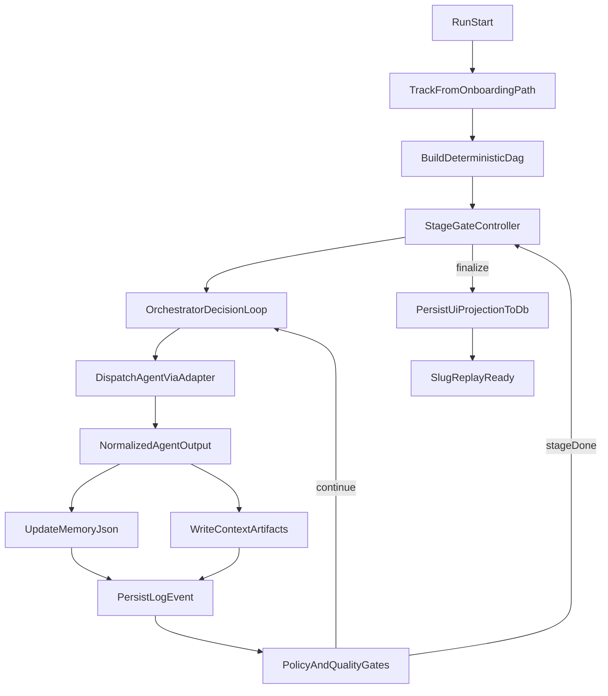

# Pipeline Orchestrator Runtime Plan [Kartavya]

## Scope And Outcome

Build a run-time orchestration layer that replaces placeholder pipeline execution with a real orchestrator engine that:

- Chooses and dispatches every agent step (agents never self-chain).
- Persists rich run artifacts under `data/pipeline_runs/<track>/<company-user-save-timestamp-runSlug>/`.
- Maintains `memory.json` and `context/` at every step.
- Streams and stores UI-ready run logs/events in DB for replay-by-slug.
- Supports deterministic DAG + adaptive policy adjustments + stage-gated safety.
- Keeps changes isolated from Shivam’s specialization branch by using adapter interfaces.

## Existing Code Anchors To Reuse

- Run route is currently placeholder and should be replaced with real orchestration entrypoint: [apps/api/src/api/v1/routes/runs.py](apps/api/src/api/v1/routes/runs.py)
- Agent dependency catalog already exists and should be treated as graph source metadata: [apps/api/src/services/agent_registry.py](apps/api/src/services/agent_registry.py)
- Upload storage path model already exists and should be mirrored for run artifacts: [apps/api/src/services/company_paths.py](apps/api/src/services/company_paths.py)
- Company settings + onboarding path are already persisted and can drive track selection for future runs: [apps/api/src/api/v1/routes/users.py](apps/api/src/api/v1/routes/users.py), [apps/api/src/schemas/auth.py](apps/api/src/schemas/auth.py)
- Current migration has base `pipeline_runs` and `uploaded_files`; extend additively: [apps/api/src/db/migrations/003_uploads_pipeline.sql](apps/api/src/db/migrations/003_uploads_pipeline.sql)
- Frontend company settings currently include public scrape toggle and can be extended with editable track settings: [apps/web/src/pages/settings/CompanyPage.tsx](apps/web/src/pages/settings/CompanyPage.tsx)

## Hard Boundaries To Minimize Merge Conflicts

- **Your scope (Kartavya):** orchestrator runtime, workflow/pipeline policy, run persistence, logs/events, run APIs, replay loading, analysis UX flow.
- **Shivam scope:** per-agent module specialization, deep prompts, agent-internal output behavior.
- **Integration contract:** orchestrator only depends on a stable `AgentExecutionAdapter` contract (`status`, `summary`, `artifacts`, `next_hints`, `confidence`, `errors`) and never depends on prompt internals.
- **Rule:** avoid modifying specialization module internals; only add adapter wrappers or contract normalization layers.

## Architecture Pattern (Hybrid)

Use a hybrid of all three modes:

1. **Deterministic DAG baseline** from selected track + registry dependencies.
2. **Policy-driven adaptive override** by orchestrator based on confidence/failure heuristics.
3. **Stage-gated guardrails** to prevent deadlocks and enforce progress.



## Run Storage Design

Root: `data/pipeline_runs/<track>/<companySlug>-<userSlug>-save-<timestamp>-<runSlug>/`

Mandatory files/folders:

- `run_manifest.json`: static run metadata (track, toggles, user/company IDs, model settings, flags, time budgets).
- `memory.json`: full mutable state + append-only events + retries + next options + failure analysis.
- `decision_ledger.jsonl`: one record per orchestrator decision (`why_this_agent`, `alternatives_considered`, `policy_mode`, `confidence`).
- `context/`
  - `context.json` (context index/meta)
  - `inputs/` (selected uploaded files metadata, scrape toggles)
  - `agent_outputs/<agentId>/<step>.json`
  - `artifacts/` (public scrape docs, extracted files, transformed payloads)
  - `quality_gates/` (validation outputs)
- `artifacts/index.json`: artifact catalog with producer, timestamp, provenance pointers.
- `final_report.json`: UI-ready final projection snapshot before DB write.

## Data Authority Model

- **During run:** filesystem is source-of-truth for runtime state.
- **For UI/live + replay:** DB is source-of-truth for display surfaces.
- Strategy:
  - Write log/event rows to DB incrementally for live feed.
  - Keep full heavy runtime internals in filesystem.
  - On completion/finalization, persist UI projection to DB (insights/summary/activity/log snapshots required for replay).

## Phase 1 — Foundation And Contracts

### Objectives

- Introduce orchestration runtime module(s) and contracts without touching specialization internals.
- Normalize track mapping from `onboarding_path` to canonical track IDs.
- Add feature flags for execution policy (parallel enabled/disabled, adaptive enabled/disabled).

### Implementation

- Create new services package:
  - `apps/api/src/services/orchestrator_runtime/engine.py`
  - `apps/api/src/services/orchestrator_runtime/policies.py`
  - `apps/api/src/services/orchestrator_runtime/contracts.py`
  - `apps/api/src/services/orchestrator_runtime/persistence.py`
  - `apps/api/src/services/orchestrator_runtime/track_profiles.py`
- Define canonical track enum and mapper for existing/future onboarding values.
- Create `AgentExecutionAdapter` abstraction that calls current agents through registry/runtime and returns normalized payload.
- Add policy flags in config:
  - `ORCH_ENABLE_PARALLEL_BRANCHES`
  - `ORCH_ENABLE_ADAPTIVE_POLICY`
  - `ORCH_ENABLE_STAGE_GATES`
  - `ORCH_MAX_RUN_SECONDS` (900 default)

### Deliverables

- Runtime scaffolding compiles and can execute no-op/dry-run path.
- Track profile packs as config files per track (priority order, optional nodes, quality gates).

## Phase 2 — Filesystem Run State And Orchestrator Loop

### Objectives

- Implement filesystem-first run lifecycle with full memory/context updates.
- Replace placeholder orchestration behavior behind `/runs/start`.

### Implementation

- In [apps/api/src/api/v1/routes/runs.py](apps/api/src/api/v1/routes/runs.py):
  - Replace placeholder logs generation with call to orchestrator runtime start method.
  - Keep response shape backward-compatible while extending with run status metadata.
- Add run directory utility module (sibling to company paths):
  - `apps/api/src/services/run_paths.py` for deterministic run folder creation and slug-safe names.
- Implement memory semantics:
  - `memory.json` includes `state`, `events[]`, `retries`, `done`, `pending`, `failed`, `next_candidates`, `timing_budget`, `warnings`, `fix_suggestions`.
- Implement context semantics:
  - `context/context.json` acts as index to all context assets.
  - Persist both compact summaries and selective raw prompts/responses where required.
- Add decision ledger append flow for every orchestrator step.

### Deliverables

- Real run folders created per run with expected structure.
- Orchestrator can progress through stage gates and update memory/context every step.

## Phase 3 — Database Replay, Live Feed, And Company-Shared File Access

### Objectives

- Make UI reproducible from DB by run slug.
- Support cross-user file visibility within same company.
- Preserve incremental live logging while run executes.

### Implementation

- Add migration(s) after `003_uploads_pipeline.sql`:
  - Expand `pipeline_runs` with replay projection fields (track, config, final status class, summary payload, final UI snapshot refs).
  - Add `pipeline_run_logs` table keyed by run ID (timestamp, stage, agent, action, detail, status, metadata JSON).
  - Add optional `pipeline_run_artifacts` table for lightweight artifact index references.
- Update run APIs in [apps/api/src/api/v1/routes/runs.py](apps/api/src/api/v1/routes/runs.py):
  - `POST /start` returns run slug and immediate status.
  - `GET /{slug}` returns replay payload sufficient to rebuild analysis UI.
  - Optional streaming/log endpoints for live panel.
- Update file listing behavior in [apps/api/src/api/v1/routes/files.py](apps/api/src/api/v1/routes/files.py):
  - Ensure all users in same company can list/select uploaded files.
  - Preserve secure company boundary.
- Add/adjust frontend flow:
  - New analysis route/page (e.g., `apps/web/src/pages/AnalysisPage.tsx`) as orchestration launch hub.
  - Upload page update to show company shared files + quick upload entry.
  - Analysis detail route by slug (existing/new page alignment with `AnalysisDetailPage.tsx`).

### Deliverables

- Copy-link by run slug works for same-company users and loads equivalent UI output from DB.
- Live logs are persisted and replayable.

## Phase 4 — Reliability: Retry, Time Budget, Parallel Branches, Quality Gates

### Objectives

- Enforce "don’t give up" behavior with bounded reliability controls.
- Implement parallel branches as configurable runtime option.
- Produce completion with warnings + actionable fix suggestions.

### Implementation

- Retry policy:
  - Per-step retry with exponential backoff.
  - Alternate-agent/model fallback via adapter when possible.
  - Global run budget hard cap 15 minutes (configurable 10-15 via env).
- Completion policy:
  - `completed`, `completed_with_warnings`, `failed_hard`.
  - For `completed_with_warnings`, include orchestrator-generated `fix_suggestions` in final payload.
- Parallel mode:
  - Run independent analysis branches concurrently after aggregation when enabled.
  - Auto-fallback to sequential if disabled or if dependency constraints fail.
- Quality gates:
  - schema validation, empty output checks, contradiction checks, confidence threshold checks before stage transitions.
- Caching / duplicate-analysis guard:
  - Hash salient input signature (company + selected file set + track + toggles + relevant config).
  - If equivalent completed run exists and fresh enough, return cached slug and mark as reused.

### Deliverables

- Stable runtime within max duration.
- Meaningful partial completion and warnings when some agents fail repeatedly.

## Phase 5 — Test Harness, Demo Hardening, And Merge Readiness

### Objectives

- Validate end-to-end orchestration flow and produce reproducible test artifacts.
- Prepare clean merge path with Shivam’s specialization branch.

### Implementation

- Fixture strategy:
  - Use `Google_Dataset_Analytics_Sample.xlsx` as deterministic test fixture (when accessible in runtime environment).
  - Add fixture loader hooks for local test runs.
- Test matrix:
  - no-upload + public scrape enabled run.
  - uploaded-files run.
  - same-company cross-user replay-by-slug.
  - sequential mode.
  - parallel mode.
  - forced non-critical failures -> `completed_with_warnings`.
  - cache-hit rerun behavior.
- Save test outputs to `Miscellaneous/tests/` with timestamped filenames.
- Merge prep checklist:
  - Verify orchestrator changes only depend on adapter contract.
  - Confirm no direct dependency on specialized prompt internals.
  - Document integration points for post-merge alignment.

### Deliverables

- Test evidence files captured in `Miscellaneous/tests/`.
- Integration notes ready for merge with specialization branch.

## Frontend Interaction Plan

- Add/adjust settings so pipeline track is editable for future runs only.
- New analysis launch UX:
  - If public scrape disabled and no files selected -> guidance to upload.
  - If public scrape enabled -> analysis can start immediately.
  - File picker shows company-shared uploads and allows adding new files.
- Analysis detail/replay page renders from DB snapshot + log stream/history.

## Non-Goals (This Plan)

- Deep per-agent prompt specialization changes.
- Full crash-resume implementation (checkpoint metadata will be prepared; complete resume can be future phase).
- External auth expansion beyond current same-company constraints.

## Risks And Mitigations

- Runtime complexity risk: mitigate via stage gates + deterministic baseline path.
- Merge conflict risk with specialization branch: mitigate via strict adapter boundary.
- Performance risk under parallel mode: mitigate with runtime toggle and fallback sequential mode.
- Data volume/log bloat: mitigate with selective raw retention + compact summaries + artifact indexing.

## Claude Code Execution Prompt (Large Block)

```text
You are implementing a production-grade orchestrator runtime for Datalyze.

CONTEXT:
- Repo has placeholder pipeline run flow and a rich agent registry.
- Shivam is simultaneously implementing agent specialization internals.
- Your mission is orchestration/workflow/runtime/storage/logging/UI replay, NOT agent specialization prompt internals.

STRICT BOUNDARIES:
1) Do not modify specialized per-agent behavior contracts unless through adapter normalization.
2) Keep merge conflicts minimal with Shivam’s branch.
3) Additive, backward-compatible API/db changes where possible.

PRIMARY GOALS:
A) Replace placeholder run execution with real orchestrator loop.
B) Persist filesystem artifacts per run:
   data/pipeline_runs/<track>/<companySlug>-<userSlug>-save-<timestamp>-<runSlug>/
   with run_manifest.json, memory.json, context/context.json, artifacts/index.json, decision_ledger.jsonl, final_report.json.
C) Orchestrator chooses next agent every step; all agent calls return to orchestrator.
D) Implement hybrid execution model:
   - deterministic DAG baseline,
   - adaptive policy overrides,
   - stage-gated quality checks.
E) Add resilient retry with max run budget <= 15 min and completion_with_warnings + fix suggestions.
F) DB-backed live/replay model by run slug so same-company users can open identical analysis views.
G) Company-shared uploaded files: users in same company can view/use each other’s uploads.
H) Add sequential/parallel orchestration toggle flags.
I) Save all test run outputs under Miscellaneous/tests/ with timestamped files.

TRACK SOURCE OF TRUTH:
- Track comes from onboarding path / profile setting.
- Track edits affect future runs only.

DATA AUTHORITY:
- During execution: filesystem is runtime truth.
- For UI: DB is truth (logs, summary projection, replay payload).

I/O CONTRACT FOR ADAPTER (CURRENT PHASE):
{
  "status": "ok|warning|error",
  "summary": "string",
  "artifacts": [],
  "next_hints": [],
  "confidence": 0.0,
  "errors": []
}

CONFIG FLAGS TO ADD:
- ORCH_ENABLE_PARALLEL_BRANCHES=true|false
- ORCH_ENABLE_ADAPTIVE_POLICY=true|false
- ORCH_ENABLE_STAGE_GATES=true|false
- ORCH_MAX_RUN_SECONDS=900

FILES TO PRIORITIZE:
- apps/api/src/api/v1/routes/runs.py
- apps/api/src/services/agent_registry.py (read-only dependency graph usage, minimal edits)
- apps/api/src/services/company_paths.py
- apps/api/src/db/migrations/003_uploads_pipeline.sql (add subsequent migration files)
- apps/web/src/pages/settings/CompanyPage.tsx
- apps/web/src/pages/UploadPage.tsx
- apps/web/src/pages/AnalysisDetailPage.tsx (or create/update)
- apps/web/src/lib/api.ts

NEW BACKEND MODULES TO ADD (suggested):
- apps/api/src/services/orchestrator_runtime/engine.py
- apps/api/src/services/orchestrator_runtime/policies.py
- apps/api/src/services/orchestrator_runtime/contracts.py
- apps/api/src/services/orchestrator_runtime/persistence.py
- apps/api/src/services/orchestrator_runtime/track_profiles.py
- apps/api/src/services/run_paths.py

DB CHANGES (add new migration):
- expand pipeline_runs for track/config/replay fields
- create pipeline_run_logs(run_id fk, timestamp, stage, agent, action, detail, status, meta_json)
- optional pipeline_run_artifacts for lightweight artifact references

LIVE + REPLAY REQUIREMENTS:
- run slug copy/share inside same company should open full analysis detail.
- replay endpoint must return enough payload to recreate dashboard cards/logs/status.

TEST FIXTURE REQUIREMENT:
- Use Miscellaneous/data/sources/Google_Dataset_Analytics_Sample.xlsx for deterministic tests when available.
- If fixture path unavailable in environment, fail gracefully and log reason.

MANDATORY VALIDATION:
1) Run backend tests/lint/type checks relevant to changed files.
2) Run frontend tests/lint/type checks relevant to changed files.
3) Run end-to-end manual flow checks for:
   - start run with uploads
   - start run with public scrape enabled and no uploads
   - replay by slug in same company
   - sequential vs parallel mode
   - forced warning completion path
4) Save verification report files in Miscellaneous/tests/:
   - <timestamp>_orchestrator-runtime-validation.md
   - <timestamp>_pipeline-replay-validation.md
   - <timestamp>_api-web-smoke.txt

IMPLEMENTATION QUALITY RULES:
- Keep code ASCII and concise.
- Add comments only where logic is non-obvious.
- Do not introduce secrets in code or test logs.
- Never hardcode user credentials.
- Keep API response compatibility where feasible.

MERGE SAFETY NOTES:
- Assume Shivam’s branch will later alter agent internals.
- Preserve adapter boundary so specialization merges cleanly.
- Add concise integration notes in code comments/docs near adapter interfaces.

DONE CRITERIA:
- Placeholder run flow removed/replaced.
- Filesystem artifacts generated and updated every step.
- DB replay works by slug for same-company users.
- Logs persist and render in UI.
- Track/profile controls drive future runs.
- Parallel/sequential toggles functional.
- Test evidence files saved under Miscellaneous/tests/.
```

## Future Enhancements (Post-Primary)

- Full checkpoint-resume execution from last successful stage.
- Shadow evaluation mode comparing placeholder/legacy vs specialized outputs post-merge.
- Rich artifact compression/retention lifecycle policies.
- Deterministic benchmark suite across multiple sample datasets.

## My friend's prompt for his work:

You are the implementation agent for Datalyze. Execute this work end-to-end with production quality.

ABSOLUTE CONTEXT SOURCES (read these first, fully):

1. .cursor/plans/agent_specialization_refactor_1e99bf6f.plan.md
2. .cursor/plans/orchestrator_pipeline_runtime_master_plan_6103e03d.plan.md

MANDATORY RULE:

- Do NOT drop or weaken any requirement from Kartavya’s existing “Claude Code Execution Prompt (Large Block)” in the orchestrator plan.
- Treat all requirements in that prompt as still active.
- This prompt ADDS specialization and test rigor on top of it; it does not replace or remove anything.

PRIMARY OBJECTIVE:
Implement all phases in the specialization plan completely, while preserving clean integration boundaries with orchestrator runtime work.
Focus scope: non-orchestrator agent specialization (except data_provenance_tracker), modular per-agent files, strict JSON outputs, deterministic behavior, low/medium token outputs, behavior-aware verification, and merge-safe handoff.

# ==================================================

IMPLEMENTATION REQUIREMENTS

A) Scope and boundaries

- In-scope: all current non-orchestrator agents except `data_provenance_tracker`.
- Out-of-scope: orchestrator runtime internals/policies/persistence/replay logic.
- Preserve integration seam with orchestrator adapter envelope:
  {
  "status": "ok|warning|error",
  "summary": "string",
  "artifacts": [],
  "next_hints": [],
  "confidence": 0.0,
  "errors": []
  }
- Keep model assignment centralized in registry (not hardcoded in per-agent files).

B) Architecture refactor goals

- Replace MVP single-file pattern with one file per specialized agent.
- Each agent file must include:
  - identity constants
  - deeply specialized system prompt
  - strict behavior constraints (role-focused, no drift)
  - JSON schema expectations for that agent
  - concise output policy (token-conscious)
  - task template(s) where applicable
- Add shared utilities for prompt guardrails (JSON-only, deterministic, concise).
- Replace `crew_mvp.py` internals with modular runtime entrypoints for specialization concerns.
- Update route wiring and imports accordingly without breaking compatibility unnecessarily.

C) Behavior quality requirements

- Strict agents (processors/classifiers/cleaning/metadata/conflict/search/transforms): hard in-scope behavior.
- Guarded agents (synthesis/summary/strategy): scoped synthesis with guardrails.
- JSON-only outputs across all in-scope agents.
- No prose outside JSON objects.
- Deterministic field naming and stable output shape per agent.

D) Verification and testing requirements (HIGH PRIORITY)
You must go beyond “hi/hello” checks.

1. Upgrade verification logic to test:

- valid JSON parseability
- required keys per agent schema
- role/scope compliance heuristics
- concise response budget checks
- adapter-envelope normalization compatibility

1. Build an intensive test matrix including:

- nominal case per agent
- edge input case per agent
- malformed/insufficient input case per agent
- off-scope prompt injection attempt per agent (verify role discipline)
- deterministic repeatability checks (multiple runs)
- performance/timing checks where practical
- external adapter behavior checks for gemini/vision/elevenlabs pathways as applicable

1. Persist deep test evidence in:

- Miscellaneous/tests/

1. Required test artifacts (timestamped):

- agent-specialization-validation.md
- agent-schema-compliance.json
- agent-scope-guard-results.json
- agent-determinism-report.json
- agent-performance-smoke.txt
- integration-normalization-report.md

1. Iteration tracking over time:

- Maintain/append a cumulative ledger:
  - Miscellaneous/tests/agent_test_history.jsonl
- One JSONL record per test run with:
  - commit hash (if available)
  - timestamp
  - agent_id
  - test_case_id
  - pass/fail
  - latency_ms
  - token_usage_estimate (if available)
  - schema_valid
  - scope_guard_passed
  - notes
- Also generate a trend summary:
  - Miscellaneous/tests/latest_agent_quality_trends.md
  - show pass rate deltas and regressions by agent.

E) Execution sequence (must follow)

1. Read both plan files fully and produce a concrete execution checklist.
2. Implement Phase 0 alignment guardrails and contract seam freezing.
3. Implement Phase 1 contract pack (per-agent schema + strictness profiles).
4. Implement Phase 2 per-agent modules and shared utilities.
5. Implement Phase 3 registry/runtime wiring and MVP replacement.
6. Implement Phase 4 verification overhaul and intensive tests.
7. Implement Phase 5 merge-ready handoff docs and integration notes.
8. Run full validation, fix defects, rerun validation.
9. Save all reports under Miscellaneous/tests with timestamps.

F) Safety and merge quality constraints

- Minimize conflict surface with orchestrator branch.
- Do not alter orchestrator internals except adapter-facing normalization seams.
- Keep changes modular and easy to cherry-pick.
- Add concise docs for:
  - where to edit prompts
  - how to add new agents
  - how schema checks are enforced
  - how normalization bridges to orchestrator adapter

G) Definition of done (must satisfy all)

- One-file-per-agent specialization complete for all in-scope non-orchestrator agents.
- JSON-only output contracts enforced.
- Verify flow validates behavior + schema + scope + normalization (not just connectivity).
- crew_mvp single-file pattern replaced in specialization path.
- Extensive test evidence logged in Miscellaneous/tests.
- Historical test tracking enabled for iteration-over-time comparisons.
- Merge handoff notes explicitly document integration with orchestrator plan.

# ==================================================

DELIVERABLE FORMAT

When finished, output:

1. What was implemented by phase
2. Files changed/added
3. Test matrix executed
4. Pass/fail summary by agent
5. Regression or risk list
6. Exact paths of all saved test artifacts in Miscellaneous/tests
7. Merge handoff notes for teammate integration

Do not stop at partial completion. Complete implementation, verification, and documentation end-to-end.
