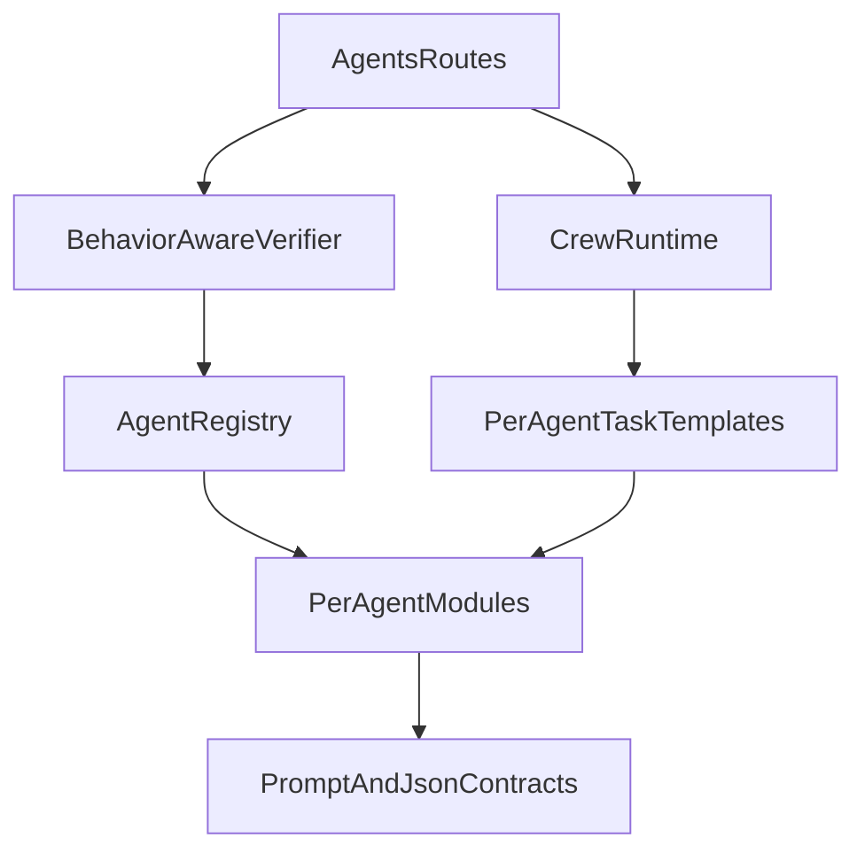

# Deep Agent Specialization Plan [SHIVAM]

## Goal

Transform the current agent runtime from a single MVP-style implementation into a modular, reusable, and strict non-orchestrator agent system where each agent has:

- its own file,
- a deeply specialized behavior contract,
- strict JSON output schema guidance,
- deterministic and low/medium token response constraints,
- task templates aligned to its function (not orchestration flow).

Primary implementation references:

- [C:/Users/skhar/Downloads/2026-RevolutionUC-Hackathon-Datalyze/apps/api/src/services/agent_registry.py](C:/Users/skhar/Downloads/2026-RevolutionUC-Hackathon-Datalyze/apps/api/src/services/agent_registry.py)
- [C:/Users/skhar/Downloads/2026-RevolutionUC-Hackathon-Datalyze/apps/api/src/services/crew_mvp.py](C:/Users/skhar/Downloads/2026-RevolutionUC-Hackathon-Datalyze/apps/api/src/services/crew_mvp.py)
- [C:/Users/skhar/Downloads/2026-RevolutionUC-Hackathon-Datalyze/apps/api/src/api/v1/routes/agents.py](C:/Users/skhar/Downloads/2026-RevolutionUC-Hackathon-Datalyze/apps/api/src/api/v1/routes/agents.py)
- [C:/Users/skhar/Downloads/2026-RevolutionUC-Hackathon-Datalyze/apps/api/scripts/verify_all_agents.py](C:/Users/skhar/Downloads/2026-RevolutionUC-Hackathon-Datalyze/apps/api/scripts/verify_all_agents.py)

## Phase 1 — Architecture Baseline and Contract Matrix

- Define the target package structure for per-agent modules under a new folder such as `services/agents/`.
- Keep orchestrator out of this refactor and target all other currently coded agents except `data_provenance_tracker`.
- Create a contract matrix from existing registry specs (id, role, inputs, outputs, responsibilities, notes) so no current agent behavior intent is lost.
- Define strictness profile by agent type:
  - strict: processors/classifiers/cleaning/metadata/conflict/search/data transforms,
  - guarded: synthesis/strategy/summary-style agents.
- Define uniform runtime guardrails shared by all agents:
  - JSON-only final output,
  - deterministic style guidance,
  - concise output limits,
  - no off-scope expansion.

## Phase 2 — Per-Agent Module Generation (One File per Agent)

- Implement one Python constructor module per in-scope non-orchestrator agent (excluding `data_provenance_tracker`).
- Each module should encapsulate:
  - agent identity constants,
  - deep system prompt,
  - explicit functional boundaries (what it does in-domain),
  - expected JSON response shape for that agent,
  - token/verbosity constraints,
  - optional task template factory for CrewAI tasks.
- Keep model binding out of these files; model remains selected in `agent_registry.py` to preserve runtime flexibility.
- Add shared prompt utilities for consistency (e.g., JSON policy fragments, deterministic response policy, concise-output constraints) while keeping each agent’s domain prompt unique and deep.
- Add an index/loader for importing all agent builders cleanly into registry/runtime wiring.

## Phase 3 — Registry and Runtime Wiring (Replace MVP)

- Refactor [C:/Users/skhar/Downloads/2026-RevolutionUC-Hackathon-Datalyze/apps/api/src/services/agent_registry.py](C:/Users/skhar/Downloads/2026-RevolutionUC-Hackathon-Datalyze/apps/api/src/services/agent_registry.py) to instantiate in-scope agents via new per-agent constructors.
- Preserve existing model assignment policy in registry (`heavy`, `heavy_alt`, `light`, etc.) and dependency metadata.
- Replace [C:/Users/skhar/Downloads/2026-RevolutionUC-Hackathon-Datalyze/apps/api/src/services/crew_mvp.py](C:/Users/skhar/Downloads/2026-RevolutionUC-Hackathon-Datalyze/apps/api/src/services/crew_mvp.py) with production runtime module(s) that use modular agent/task templates instead of inline MVP definitions.
- Update [C:/Users/skhar/Downloads/2026-RevolutionUC-Hackathon-Datalyze/apps/api/src/api/v1/routes/agents.py](C:/Users/skhar/Downloads/2026-RevolutionUC-Hackathon-Datalyze/apps/api/src/api/v1/routes/agents.py) imports/calls to the new runtime entrypoints.
- Maintain endpoint behavior compatibility where practical (`/agents/mvp` can be renamed internally but should still function unless intentionally migrated with route updates).

## Phase 4 — JSON Contract Enforcement and Behavioral Verification

- Upgrade agent verification logic from “hi/hello” pings to behavior-aware checks per agent category.
- Extend [C:/Users/skhar/Downloads/2026-RevolutionUC-Hackathon-Datalyze/apps/api/scripts/verify_all_agents.py](C:/Users/skhar/Downloads/2026-RevolutionUC-Hackathon-Datalyze/apps/api/scripts/verify_all_agents.py) and corresponding API checks to validate:
  - JSON parseability,
  - required schema keys present for each agent,
  - scope compliance heuristics (agent does its role, not unrelated work),
  - concise-output conformance.
- Keep checks lightweight enough for local iteration speed while providing clear pass/fail diagnostics by agent id.
- Add targeted test prompts per agent type (processing, analysis, synthesis, external-service adapters) so verification reflects intended behavior rather than generic liveness.

## Phase 5 — Hardening, Cleanup, and Handoff Readiness

- Remove MVP-centric assumptions and naming from runtime internals.
- Ensure no residual single-file crew logic remains as a dependency for non-orchestrator behavior.
- Validate boot and verify endpoints still provide reliable status summaries and actionable error details.
- Add concise developer docs for the new modular agent system:
  - where to edit prompts,
  - how JSON schemas are enforced,
  - how to add a new agent file,
  - where model assignment is controlled.
- Finalize with deterministic-output sanity checks and regression pass for changed routes/services.

## Proposed Runtime Shape (Post-Refactor)

## Success Criteria

- Every in-scope non-orchestrator agent is in its own file with deep, role-specific prompt logic.
- All agent outputs are JSON-structured and schema-guided by agent type.
- Strict agents stay in-domain; guarded agents synthesize without drifting off-scope.
- Model assignment remains centralized in registry, not hardcoded in agent files.
- MVP single-file crew structure is fully replaced, and route wiring is updated.
- Verification validates role behavior and JSON contracts (not just connectivity).

